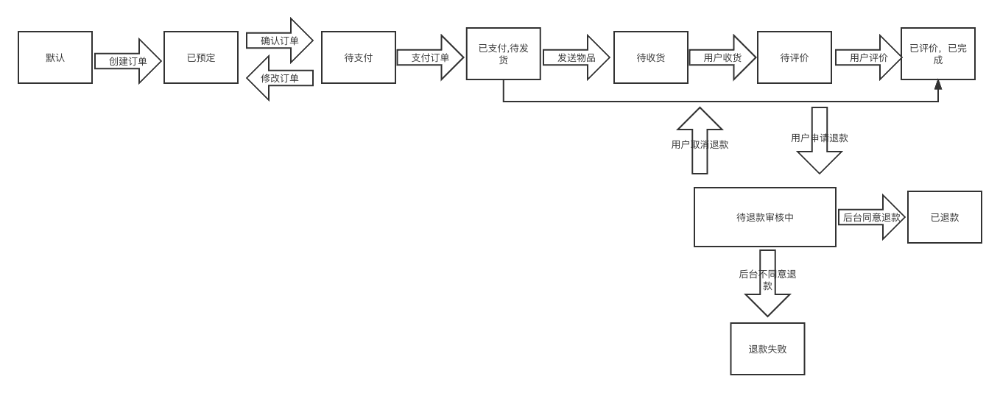

# order_machine

# Quick Start
```shell
docker-compose up -d
```

# 多实例部署
```shell
docker-compose up --scale app=n app
```

# 订单流程图


注: 订单完成状态不应该可以执行退款事件，图错误
## 有限状态机

### 简介
有限状态机（Finite-state machine，简写：FSM）又可以称作有限状态自动机，简称状态机。

它必须是可以附着在某种事物上的，且该事物的状态是有限的，通过某些触发事件，会让其状态发生转换。为此，有限状态机就是描述这些有限的状态和触发事件及转换行为的数学模型。

PS:关于状态机的简介可以去网上搜索，以上供参考。

### 特性
- 状态总数（state）是有限的。
- 任一时刻，只处在一种状态之中。
- 某种条件下，会从一种状态转变（transition）到另一种状态。